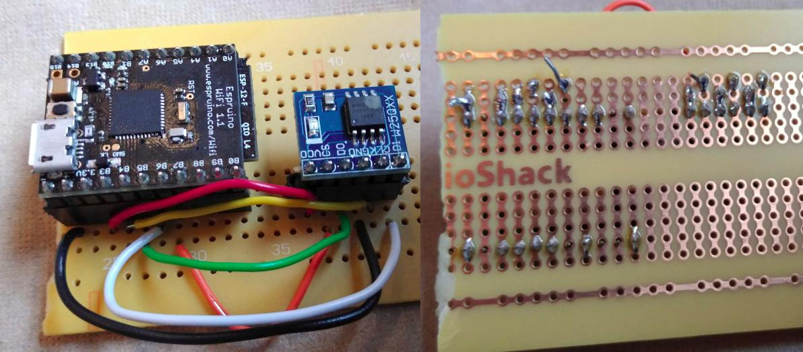

<!--- Copyright (c) 2015 Dennis Bemmann. See the file LICENSE for copying permission. -->
espruino-w25q
=============
Wiring
------

Find out which pins of your Espruino are SPI-capable. Connect the SPI pins to the corresponding pins on the W25Q Flash memory.

Initialization
----------
```
var myfl = require("W25Q");
var myflash = new myfl(SPI1, B6 /*CS*/);
SPI1.setup({ mosi: B5, miso: B4, sck: B3});
```

The memory of the W25Q Flash is organized in pages of 256 bytes each, and sectors of 16 pages each.

| Sector | Start Page | End Page |
|---------|--------|---------|
|0 |0 |15|
|1 |16 |31|
|2 |32 |47|

etc.

Preparation for Writing
-----------------------
Before you can write to Flash memory, you must first erase the flash memory at the address which you want to write to. In the case of Winbond WQ25, individual bytes or pages cannot be erased-the minimum quantity that can be erased is a sector(16 pages at once.)

```
myflash.erase16Pages(page);
```

Note: If you send a command to erase a section with a page number in between start and end, the sector in which the page is will be erased.
For example:
If you send a command to erase at page 5, then pages 0 to 15 will be erased.

Writing and Reading
-------------------

```
var page = 345;
const uint8 = new Uint8Array(256);
uint8.fill(101, 0, 256);        //(value, start position, end position);
myflash.erase16Pages(page);
myflash.writePage(page, uint8);
console.log(myflash.readPage(page));
```


Sector Modification
-------------------
If you want to modify data in a sector without losing the rest of the data of the sector, you would have to first read the sector into an array, modify the array, and then write the (modified) array back to the flash memory.

```
var mysector = myflash.readSector(1);
mysector[123] = 72;
myflash.erase16Pages(16);
myflash.writeSector(16, mysector);
```
